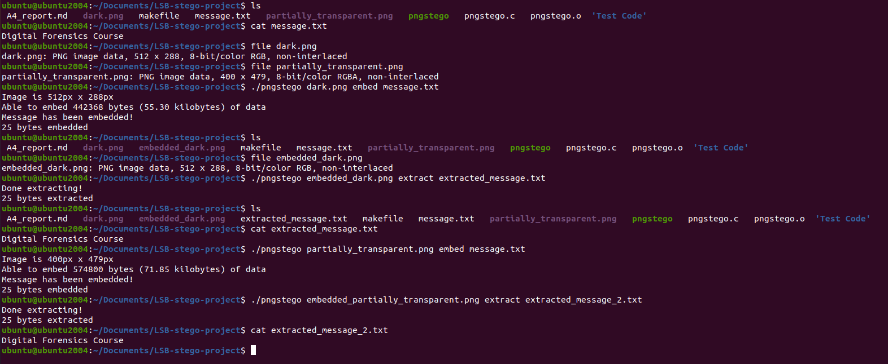

# Summary
This program embeds a given message into a given PNG image using least significant
bit steganography. It supports RGB and RGBA images, but only supports text
systems that use one byte-per-character (ASCII, not unicode). It can also extract
data from an image modified with this tool.

The first 32 bytes of the image are reserved for storing the length (in bytes)
of the message. The message is then embedded in the first `n` bytes of the image.
The program does not modify bytes past the end of the message.

# Dependencies

- libpng version 1.6.37
    - libpng requires zlib, so that must also be installed
    - https://sourceforge.net/projects/libpng/files/


# Usage

```
$ make
$ ./pngstego filename.png embed message.txt
OR
$ ./pngstego embedded_filename.png extract output_filename
```

# Example Usage



# Sample Images

## RGB

Original


Embedded with message "Digital Forensics Course"


## RGBA

Original


Embedded with message "Digital Forensics Course"


# Source Code
```
/*
  Program to embed a message into a given PNG image using the LSB
    (Least Significant Bit) method.

  References:
    www.libpng.org/pub/png/libpng-1.4.0-manual.pdf
    www.codeproject.com/Articles/581298/PNG-Image-Steganography-with-libpng

  Usage: $ ./pngstego filename.png embed message
         $ ./pngstego filename.png extract

  Dependencies: Compiled using libpng version 1.6.37
*/

#include <png.h>
#include <zlib.h>
#include <stdio.h>
#include <stdlib.h>
#include <stdbool.h>
#include <string.h>
#include <ctype.h>
#include <errno.h>
#include <math.h>
#include <sys/stat.h>
#include <sys/types.h>
#include <unistd.h>

/**
    If the user enters a variation of this word as the third command line
    argument, the program will embed a message into a PNG
*/
#define EMBED_TEXT "EMBED"

/**
    If the user enters a variation of this word as the third command line
    argument, the program will extract a message from a PNG
*/
#define EXTRACT_TEXT "EXTRACT"

/**
    The program builds the filename for the modified PNG programatically.
    This is the maximum filename length for that file.
*/
#define FILENAME_MAX_LENGTH 256

/**
    The length of the embedded message will be stored at the beginning of
    the modified PNG. This is how many bytes in the PNG will be taken up by this value,
    but is also how many bits that are needed to represent the length of the
    message. 32 bits provides more space than a person could ever need for basic
    text messages.
*/
#define BITS_NEEDED_TO_STORE_MESSAGE_LENGTH 32

/**
    This is how many bytes the PNG header takes up in the file. The program reads
    this amount of bytes before operating to confirm that the given file is a PNG.
*/
#define HEADER_LENGTH 8

/**
    This is the number of bits in a byte. Used in the many bitwise operations in
    this program.
*/
#define BYTE_SIZE 8

/**
    This is an array of pointers to all the rows of the image. It is used to
    traverse the image in the embed and extract functions.
*/
png_bytep* row_pointers;

/**
    This struct stores the metadata from the PNG.
*/
png_infop info_ptr;

/**
    This struct stores data related to the reading of the image. It is used
    to access properties like the width and height of the image.
*/
png_structp read_ptr;

/**
    This struct stores data related to writing to a PNG.
*/
png_structp write_ptr;

/**
    This is the name of the original PNG image, provided on the command line,
    that the user's message will be embedded into.
*/
const char* PNG_filename;

/**
    This is the name, provided on the command line, of the file that the extracted
    message will be written to.
*/
const char* output_filename;

/**
    This is a file pointer for the above output_filename file.
*/
FILE* output_fp;

/**
    This value is provided on the command line and is either EMBED_TEXT or
    EXTRACT_TEXT. It is used to decide whether to extract or embed data.
*/
const char* method;

/**
    This is the filename of the file containing the message to embed in the provided
    PNG image. This is provided on the command line.
*/
const char* message_filename;

/**
    This is a file pointer to the above message file.
    ------------------------------------------------------------------------------
    WARNING: Non-ASCII values in the message are not supported and will result in
              undefined behaviour!
    ------------------------------------------------------------------------------
*/
FILE* message_fp;

/**
    This is the length, in characters (bytes), of the message contained in the
    provided message file.
*/
size_t message_length;

/**
    This is the space, in bytes, available in the image for embedding. This program
    uses the LSB method, so only one bit in each byte is being used.
*/
int available_space;

/**
    This is the filename of the modified PNG file. This program will write the modified
    data to this file when it is done embedding the message.
*/
char* PNG_output_filename;

/**
    This function opens the provided PNG image and performs prelimiary checks.
    It reads the header, initializes IO and data structures, then reads the entire
    image into memory.
*/
void open_png_file(const char* PNG_filename);

/**
    This function modifies the least significant bit of each byte of the provided
    image to hide a provided message. The first BITS_NEEDED_TO_STORE_MESSAGE_LENGTH are
    reserved for holding the size of the message. This function modifies the minimum
    number of bytes to embed the message, the rest are left alone.
*/
void embed_data();

/**
    This function combines the least significant bits of each byte of the provided
    image and writes them to the provided output file. It first reads the first
    BITS_NEEDED_TO_STORE_MESSAGE_LENGTH to see how many bytes to extract, then
    extracts them. It stops when the specified number of bytes are read, and does
    not interact with the rest of the image.
*/
void extract_data();

/**
    This function writes the modified PNG data to a new file to keep it independent
    from the original. This is done once all the embedding is finished.
*/
void output_embedded_png();

/**
    This function calculates the number of bits that the user can embed within
    the provided image.
*/
void calculate_available_space(png_structp read_ptr, png_infop info_ptr);

/**
    This function compares the provided message length with the amount of available
    space. If there is not enough space, the user will be prompted to either
    chop off the end of the message or exit the program.
*/
bool check_message_size();

/**
    This function frees up the data structures that were made and exits the program.
*/
void exit_cleanly();

/**
    This function pulls in the arguments from the command line, then decides whether
    to embed or extract data using the provided image.
*/
int main(int argc, char* argv[]){

    //Check number of command line arguments
    if(argc < 4){
        fprintf(stderr, "Usage: \t$ ./pngstego filename.png embed message_filename\n"
                        "\t$ ./pngstego filename.png extract output_filename\n");
        exit_cleanly();
    }

    //Get the PNG filename from the command line
    PNG_filename = argv[1];

    //Uncompress and unfilter the PNG
    open_png_file(PNG_filename);

    //Get the method being requested (embed or extract)
    method = argv[2];

    //If embed, embed the message from the provided file into the PNG
    if(strncasecmp(method, EMBED_TEXT, strlen(EMBED_TEXT)) == 0){

        //Calculate the amount of data able to be embedded
        calculate_available_space(read_ptr, info_ptr);

        //Open the file containing the message to embed
        message_filename = argv[3];
        message_fp = fopen(message_filename, "rb");
        if(message_fp == NULL){
            fprintf(stderr, "Error opening message file(): %s\n", strerror(errno));
            exit_cleanly();
        }

        if(check_message_size()){
            //Create the output png's filename
            char temp[FILENAME_MAX_LENGTH] = "embedded_";
            strcat(temp, PNG_filename);
            PNG_output_filename = temp;
            embed_data();
        }else{
            exit_cleanly();
        }
    }
    //If extract, extract the message from the PNG image and write it to a file.
    else if(strncasecmp(method, EXTRACT_TEXT, strlen(EXTRACT_TEXT)) == 0){
        output_filename = argv[3];
        output_fp = fopen(output_filename, "wb");
        if(output_fp == NULL){
            fprintf(stderr, "Error opening output file(): %s\n", strerror(errno));
            exit_cleanly();
        }

        extract_data();
    }

    return 0;
}

void open_png_file(const char* PNG_filename){
    FILE* PNG_file;
    unsigned char header[BYTE_SIZE];

    //Open the file
    PNG_file = fopen(PNG_filename, "rb");
    if(PNG_file == NULL){
        fprintf(stderr, "Error in open_png_file(): %s\n", strerror(errno));
        exit_cleanly();
    }

    //Start reading the file
    fread(header, 1, HEADER_LENGTH, PNG_file);

    //Check if the file is actually a PNG
    if(png_sig_cmp(header, 0, HEADER_LENGTH)){
        fprintf(stderr, "Error in open_png_file(): File is not a .PNG."
                        " Only .PNG files are supported\n");
        exit_cleanly();
    }

    //Initialize data structures
    //  Nulls are for optional custom error handlers. I am using the defaults.
    read_ptr = png_create_read_struct(PNG_LIBPNG_VER_STRING, NULL, NULL, NULL);
    if(read_ptr == NULL){
        fprintf(stderr, "Error in open_png_file(): png_create_read_struct() returned NULL\n");
        exit_cleanly();
    }

    info_ptr = png_create_info_struct(read_ptr);
    if(info_ptr == NULL){
        fprintf(stderr, "Error in open_png_file(): png_create_info_struct() returned NULL\n");
        exit_cleanly();
    }

    //Initialize IO
    png_init_io(read_ptr, PNG_file);

    //HEADER_LENGTH bytes were read at the beginning, we must let libpng know.
    png_set_sig_bytes(read_ptr, HEADER_LENGTH);

    //Read entire PNG into memory
    png_read_png(read_ptr, info_ptr, PNG_TRANSFORM_IDENTITY, NULL);

    row_pointers = png_get_rows(read_ptr, info_ptr);

    //Only accept PNGs with depths of 8 bits
    int bit_depth = png_get_bit_depth(read_ptr, info_ptr);
    if(bit_depth != BYTE_SIZE){
        fprintf(stderr, "Error in open_png_file(): File's bit depth is not valid."
                        " Provided image's bit depth is %d, only 8 bit depths are supported\n",
                        bit_depth);
        exit_cleanly();
    }


    fclose(PNG_file);
}

void embed_data(){

    int row;
    int max_rows = png_get_image_height(read_ptr, info_ptr);
    int max_cols = png_get_image_width(read_ptr, info_ptr);
    char buffer = 0;
    int bits_embedded = 0;

    for(row = 0; row < max_rows; row++){
        int col = 0;
        //Write the size of the message (bytes) into the first BITS_NEEDED_TO_STORE_MESSAGE_LENGTH
        // bytes of the image. If 32 bits are needed to store the message, then
        // 32 bytes of the image will be filled.
        if(row == 0){
            for(col; col < BITS_NEEDED_TO_STORE_MESSAGE_LENGTH; col++){
                //Loops over each bit in message_length and puts that bit into
                // the LSB of the current byte.
                if(message_length & (int)pow(2, col)){
                    *(row_pointers[row] + col) |= 1; //Set the LSB using bitwise or
                }else{
                    *(row_pointers[row] + col) &= 0xFE; //Sets the LSB to 0
                }
            }
        }

        //We need the width to be in bytes, but max_cols is in pixels. So, we
        // multiply it by 3 since there are 3 bytes in a pixel
        for(col; col < max_cols * 3; col++){
            if(col % BYTE_SIZE == 0){
                //If we've encoded 8 bits it is time to read the next byte
                if(!fread(&buffer, 1, 1, message_fp)){
                    break;
                }
            }

            //Do the actual embedding
            if(buffer & (int)pow(2, col % BYTE_SIZE)){
                *(row_pointers[row] + col) |= 1;
            }else{
                *(row_pointers[row] + col) &= 0xFE;
            }
            bits_embedded++;
        }
    }

    fprintf(stdout, "Message has been embedded!\n%d bytes embedded\n", (int)(bits_embedded/BYTE_SIZE));

    fclose(message_fp);
    output_embedded_png();
}

void extract_data(){
    int row;
    int max_rows = png_get_image_height(read_ptr, info_ptr);
    int max_cols = png_get_image_width(read_ptr, info_ptr);
    char buffer = 0;
    int bits_extracted = 0;
    bool done_extracting = false;

    for(row = 0; row < max_rows; row++){
        if(done_extracting){
            break;
        }
        int col = 0;
        if(row == 0){
            //Extract the size of the message from the first BITS_NEEDED_TO_STORE_MESSAGE_LENGTH bytes
            for(col; col < BITS_NEEDED_TO_STORE_MESSAGE_LENGTH; col++){
                message_length |= ((*(row_pointers[0] + col) & 1) << col);
            }
        }

        //Extract the actual message
        for(col; col < max_cols * 3; col++){
            //If we're beyond the size metadata and we've extracted 8 bits, write the byte to the file
            if((col > BITS_NEEDED_TO_STORE_MESSAGE_LENGTH || row > 0) && col % BYTE_SIZE == 0){
                fwrite(&buffer, 1, 1, output_fp);
                buffer = 0;
            }

            //Check if all the data has been extracted
            int bytes_read = (max_cols * row) * 3 + col;
            if(bytes_read == (message_length * BYTE_SIZE) + BITS_NEEDED_TO_STORE_MESSAGE_LENGTH){
                done_extracting = true;
                break;
            }

            //Do the actual extracting
            buffer |= ((*(row_pointers[row] + col) & 1) << col % BYTE_SIZE);
            bits_extracted++;
        }
    }

    fprintf(stdout, "Done extracting!\n%d bytes extracted\n", (int)(bits_extracted / BYTE_SIZE));
    fclose(output_fp);
}

void output_embedded_png(){
    FILE* output_png_fp;
    output_png_fp = fopen(PNG_output_filename, "wb");
    if(output_png_fp == NULL){
        fprintf(stderr, "Error in output_embedded_png(): %s\n", strerror(errno));
        exit_cleanly();
    }

    write_ptr = png_create_write_struct(PNG_LIBPNG_VER_STRING, NULL, NULL, NULL);
    if(write_ptr == NULL){
        fprintf(stderr, "Error in output_embedded_png(): png_create_write_struct() returned NULL\n");
        exit_cleanly();
    }

    png_init_io(write_ptr, output_png_fp);
    png_set_rows(write_ptr, info_ptr, row_pointers);
    png_write_png(write_ptr, info_ptr, PNG_TRANSFORM_IDENTITY, NULL);
    fclose(output_png_fp);
}

void calculate_available_space(png_structp read_ptr, png_infop info_ptr){
    int width = png_get_image_width(read_ptr, info_ptr);
    int height = png_get_image_height(read_ptr, info_ptr);

    fprintf(stdout, "Image is %dpx x %dpx\n", width, height);

    //One pixel is 3 bytes, we can store 1 bit per byte. So, we can store
    // 3 bits per pixel.

    available_space = (width * height) * 3;
    float available_space_kb = available_space * 0.000125;

    fprintf(stdout, "Able to embed %d bytes (%.2f kilobytes) of data\n",
                    available_space, available_space_kb);
}

bool check_message_size(){
    struct stat st;
    int err = stat(message_filename, &st);
    if(err == -1){
        fprintf(stderr, "Error in check_message_size(): %s\n", strerror(errno));
        exit_cleanly();
    }
    message_length = st.st_size;

    if(message_length > available_space){
        fprintf(stderr, "Warning! Message is too large to embed in"
                        " the provided image (%zu bytes too large).\nDo you"
                        " wish to embed only the first %d bytes of the message"
                        " instead? Y/N\n> ", message_length - available_space, available_space);
        char input;
        fscanf(stdin, " %c", &input);
        getchar();
        input = toupper(input);
        if(input != 'Y'){
            return false;
        }

        message_length = available_space;
    }

    return true;
}

void exit_cleanly(){
    //Free memory
    if(read_ptr && info_ptr){
        fprintf(stdout, "Freeing Read Memory...\n");
        png_destroy_read_struct(&read_ptr, &info_ptr, (png_infopp)NULL);
    }
    if(write_ptr){
        fprintf(stdout, "Freeing Write Memory...\n");
        png_destroy_write_struct(&write_ptr, (png_infopp)NULL);
    }

    fprintf(stderr, "Exiting...\n");
    exit(EXIT_SUCCESS);
}

```
